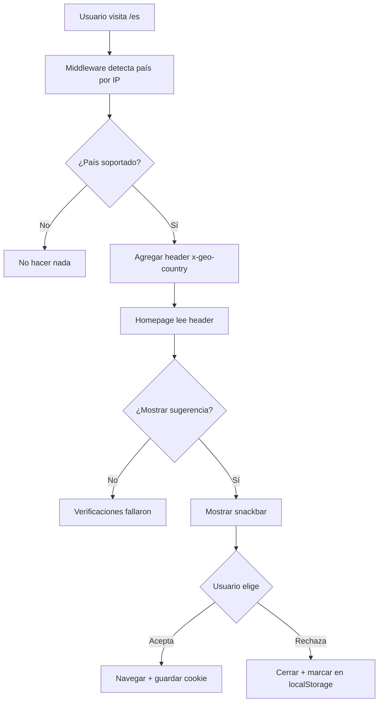

# Geo Suggestion - Documentación de Implementación

## 📋 Resumen

Sistema de sugerencia de país no intrusiva basada en geolocalización. Detecta automáticamente el país del usuario y sugiere cambiar al contenido localizado, pero nunca redirige automáticamente.

## ✅ Implementación Completada

**Fecha**: Diciembre 2024  
**Estado**: ✅ **COMPLETADO** - Sistema no intrusivo funcional

---

## 🎯 Objetivo

Mejorar la experiencia del usuario sugiriendo su país detectado, **sin ser intrusivo**:
- ✅ Detecta país por IP (geolocalización)
- ✅ Muestra snackbar amigable
- ✅ Usuario decide si acepta o rechaza
- ✅ Se muestra solo una vez
- ✅ Respeta preferencias existentes
- ❌ **NO redirige automáticamente**

---

## 🏗️ Arquitectura

### Flujo Completo



### Verificaciones para Mostrar

El snackbar se muestra **SOLO SI**:

1. ✅ Hay país sugerido válido (header `x-geo-country`)
2. ✅ País sugerido ≠ país actual
3. ✅ No existe cookie `forja_lc` (sin preferencia guardada)
4. ✅ No se mostró antes (localStorage `forja_geo_suggest_shown`)
5. ✅ Usuario está en la homepage

---

## 📦 Componentes Implementados

### 1. `middleware.ts` - Detección de País ✅

**Función Agregada**:

```typescript
function mapCountryToLocale(countryCode?: string): string | null {
  const countryMap: Record<string, string> = {
    'CO': 'es-co',  // Colombia
    'CL': 'es-cl',  // Chile
    'PE': 'es-pe',  // Perú
    'EC': 'es-ec',  // Ecuador
  };
  
  return countryMap[countryCode.toUpperCase()] || null;
}
```

**Lógica**:

```typescript
// En middleware
const geoCountry = request.geo?.country;  // Vercel Edge auto-detecta
const suggestedLocale = mapCountryToLocale(geoCountry);

// Agregar header
response.headers.set('x-geo-country', suggestedLocale);
```

**Header Generado**:
```
x-geo-country: es-co
```

### 2. `components/country/CountrySuggest.tsx` - Snackbar ✅

**Características**:

```typescript
interface CountrySuggestProps {
  suggestedLocale?: string | null;  // Del header
  currentLocale?: string;            // Del params.lc
}
```

**Verificaciones Implementadas**:

```typescript
const checkShouldShowSuggestion = (suggested, current) => {
  // 1. ¿Hay sugerencia válida?
  if (!suggested || !COUNTRIES[suggested]) return false;
  
  // 2. ¿Es diferente al actual?
  if (suggested === current) return false;
  
  // 3. ¿Ya tiene preferencia?
  if (hasCountryPreference()) return false;
  
  // 4. ¿Ya se mostró antes?
  if (localStorage.getItem('forja_geo_suggest_shown')) return false;
  
  return true;
};
```

**Acciones del Usuario**:

```typescript
// Usuario acepta
const handleAccept = () => {
  setCountryPreference(suggestedLocale);  // Cookie 6 meses
  localStorage.setItem('forja_geo_suggest_shown', 'true');
  router.push(`/${suggestedLocale}`);     // Navegar
};

// Usuario rechaza
const handleDismiss = () => {
  localStorage.setItem('forja_geo_suggest_shown', 'true');
  closeSnackbar();
};
```

### 3. `app/[lc]/page.tsx` - Integración ✅

**Lectura de Header**:

```typescript
import { headers } from 'next/headers';

export default function LocaleHome({ params }: LocaleHomeProps) {
  const headersList = headers();
  const geoCountry = headersList.get('x-geo-country');

  return (
    <>
      <CountrySuggest 
        suggestedLocale={geoCountry} 
        currentLocale={params.lc}
      />
      {/* Resto del contenido */}
    </>
  );
}
```

---

## 🎨 Diseño Visual

### Snackbar Completo

```
┌────────────────────────────────────────────────┐
│  🗺️  Parece que estás en Colombia 🇨🇴        │
│                                                 │
│  ¿Quieres ver el contenido para Colombia?     │
│                                                 │
│  [ Sí, cambiar a Colombia ]  [ No, gracias ] ╳ │
└────────────────────────────────────────────────┘
```

**Posición**: Bottom-center, fixed  
**Z-index**: 50 (por encima de contenido)  
**Animación**: Fade-in + slide-up  
**Duración**: Hasta que usuario interactúe  

### Estados

#### Estado Inicial
```css
opacity: 0
transform: translateY(16px)
```

#### Estado Visible
```css
opacity: 1
transform: translateY(0)
transition: all 300ms
```

#### Estado Cerrando
```css
opacity: 0
transform: translateY(16px)
transition: all 300ms
```

---

## 🔄 Casos de Uso

### Caso 1: Primera Visita desde Colombia

```
1. Usuario colombiano visita https://forjadigital.com
   ↓
2. Middleware: request.geo.country = 'CO'
   ↓
3. Middleware: x-geo-country = 'es-co'
   ↓
4. Redirige a /es (default)
   ↓
5. Homepage lee header: es-co
   ↓
6. Verificaciones:
   - Sugerido (es-co) ≠ Actual (es) ✅
   - Sin cookie ✅
   - No mostrado antes ✅
   ↓
7. Snackbar aparece (1.5s delay)
   ↓
8a. Usuario acepta:
    - Cookie: forja_lc=es-co
    - LocalStorage: forja_geo_suggest_shown=true
    - Navega a /es-co
    ↓
8b. Usuario rechaza:
    - LocalStorage: forja_geo_suggest_shown=true
    - Cierra snackbar
```

### Caso 2: Usuario con Preferencia Existente

```
1. Usuario con cookie forja_lc=es-cl
   ↓
2. Middleware detecta CO
   ↓
3. Header: x-geo-country=es-co
   ↓
4. Verificación: hasCountryPreference() = true
   ↓
5. NO mostrar snackbar (respeta preferencia)
```

### Caso 3: Segunda Visita (Ya Rechazó)

```
1. Usuario ya rechazó antes
   ↓
2. LocalStorage: forja_geo_suggest_shown=true
   ↓
3. Verificación falla
   ↓
4. NO mostrar snackbar
```

### Caso 4: País No Soportado

```
1. Usuario desde USA
   ↓
2. Middleware: request.geo.country = 'US'
   ↓
3. mapCountryToLocale('US') = null
   ↓
4. NO agregar header
   ↓
5. NO mostrar snackbar
```

---

## 💻 Código de Ejemplo

### Leer Header en Server Component

```typescript
import { headers } from 'next/headers';

export default async function Page() {
  const headersList = headers();
  const geoCountry = headersList.get('x-geo-country');
  
  console.log('País sugerido:', geoCountry);
  
  return <CountrySuggest suggestedLocale={geoCountry} />;
}
```

### Verificar LocalStorage

```typescript
// En console del navegador
localStorage.getItem('forja_geo_suggest_shown'); // 'true' o null
```

### Resetear Sugerencia (Testing)

```typescript
// Para volver a ver el snackbar
localStorage.removeItem('forja_geo_suggest_shown');
// Recargar página
```

---

## ♿ Accesibilidad

### Implementado

- ✅ `role="alertdialog"` para snackbar
- ✅ `aria-live="polite"` (no interrumpe)
- ✅ `aria-atomic="true"` (lee todo el mensaje)
- ✅ Botones con labels descriptivos
- ✅ Focus management
- ✅ Escape para cerrar
- ✅ Alto contraste

### Navegación por Teclado

| Tecla | Acción |
|-------|--------|
| `Tab` | Navegar entre botones |
| `Enter` / `Space` | Activar botón |
| `Escape` | Cerrar snackbar |

---

## 🧪 Testing

### Test 1: Primera Visita

**Setup**:
```bash
1. Limpiar cookies y localStorage
2. Usar VPN a Colombia
3. Abrir https://forjadigital.com
```

**Esperado**:
```
✅ Redirige a /es
✅ Snackbar aparece (1.5s delay)
✅ Muestra "Colombia 🇨🇴"
✅ Botón "Sí" lleva a /es-co
✅ Cookie guardada
✅ LocalStorage marcado
```

### Test 2: Con Preferencia Existente

**Setup**:
```typescript
// En console
document.cookie = "forja_lc=es-cl; path=/; max-age=31536000";
```

**Esperado**:
```
✅ NO muestra snackbar
✅ Respeta preferencia existente
```

### Test 3: Ya Rechazó

**Setup**:
```typescript
localStorage.setItem('forja_geo_suggest_shown', 'true');
```

**Esperado**:
```
✅ NO muestra snackbar
✅ No molesta de nuevo
```

### Test 4: Desarrollo Local (Sin Geo)

**Setup**:
```bash
npm run dev
http://localhost:3000/es
```

**Esperado**:
```
✅ request.geo es undefined
✅ NO hay header x-geo-country
✅ NO muestra snackbar
✅ App funciona normal
```

---

## 🐛 Debugging

### Problema: Snackbar No Aparece

**Verificar**:

```typescript
// 1. ¿Hay header?
const headersList = headers();
console.log('Geo header:', headersList.get('x-geo-country'));

// 2. ¿Hay cookie?
import { hasCountryPreference } from '@/lib/utils/cookies-country';
console.log('Tiene preferencia:', hasCountryPreference());

// 3. ¿Ya se mostró?
console.log('Ya mostrado:', localStorage.getItem('forja_geo_suggest_shown'));
```

### Problema: Aparece en Todas las Páginas

**Solución**:
```typescript
// CountrySuggest solo debe renderizarse en homepage
// Verificar app/[lc]/page.tsx
<CountrySuggest /> // Solo aquí
```

### Problema: No Detecta País

**Solución**:
```typescript
// request.geo solo funciona en Vercel Edge
// En desarrollo local, simular:
response.headers.set('x-geo-country', 'es-co'); // Testing
```

---

## 📊 Mapeo de Países

### Países Soportados

| ISO | País | Locale |
|-----|------|--------|
| CO | Colombia | es-co |
| CL | Chile | es-cl |
| PE | Perú | es-pe |
| EC | Ecuador | es-ec |

### Agregar Más Países

```typescript
// En middleware.ts
function mapCountryToLocale(countryCode?: string): string | null {
  const countryMap: Record<string, string> = {
    'CO': 'es-co',
    'CL': 'es-cl',
    'PE': 'es-pe',
    'EC': 'es-ec',
    'MX': 'es-mx',  // ← Agregar México
    'AR': 'es-ar',  // ← Agregar Argentina
  };
  
  return countryMap[countryCode.toUpperCase()] || null;
}
```

---

## 🚀 Mejoras Futuras (Opcionales)

### 1. A/B Testing

Probar diferentes mensajes:

```typescript
const messages = {
  friendly: "¡Hola! Parece que estás en Colombia 🇨🇴",
  direct: "Contenido disponible para Colombia",
  question: "¿Estás en Colombia?",
};
```

### 2. Analytics

Trackear interacciones:

```typescript
const handleAccept = () => {
  analytics.track('geo_suggest_accepted', {
    suggested: suggestedLocale,
    current: currentLocale,
  });
  // ...
};

const handleDismiss = () => {
  analytics.track('geo_suggest_dismissed', {
    suggested: suggestedLocale,
  });
  // ...
};
```

### 3. Configuración por Usuario

Permitir reactivar:

```typescript
// En configuración de usuario
<button onClick={() => {
  localStorage.removeItem('forja_geo_suggest_shown');
}}>
  Volver a mostrar sugerencias de país
</button>
```

### 4. Delay Configurable

```typescript
const SUGGESTION_DELAY = process.env.NEXT_PUBLIC_GEO_DELAY || 1500;

setTimeout(() => {
  setIsVisible(true);
}, SUGGESTION_DELAY);
```

---

## 📚 Referencias

- **Vercel Edge Geo**: https://vercel.com/docs/concepts/edge-network/headers#request-headers
- **Next.js Middleware**: https://nextjs.org/docs/app/building-your-application/routing/middleware
- **Web Storage API**: https://developer.mozilla.org/en-US/docs/Web/API/Web_Storage_API

---

## ✨ Beneficios

1. **UX Mejorada**: Sugerencia inteligente sin ser intrusiva
2. **No Intrusivo**: Usuario mantiene control total
3. **Respeta Preferencias**: No molesta si ya eligió
4. **Una Sola Vez**: No repite la sugerencia
5. **Performance**: No afecta carga de página
6. **Privacidad**: Solo usa IP, no tracking adicional

---

**🎉 IMPLEMENTACIÓN COMPLETADA**

El sistema de geosugerencia está funcional y respeta todas las mejores prácticas de UX.

---

_Generado por CURSOR - Edge/Frontend Engineer_  
_Fecha: Diciembre 2024_

